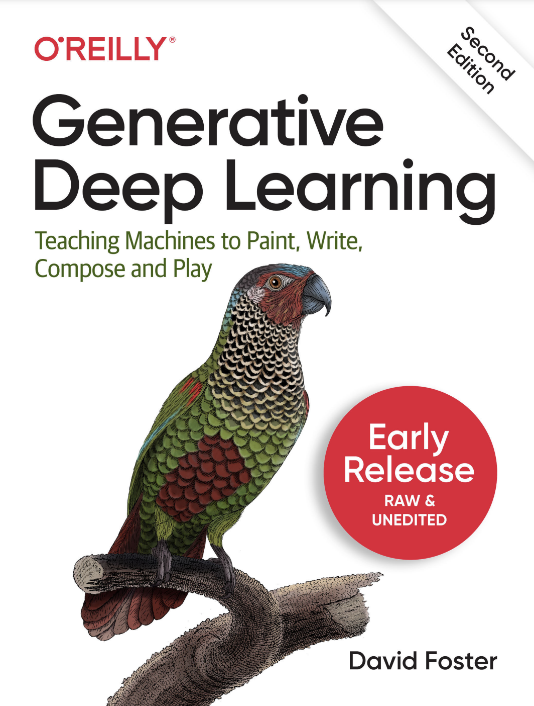

# 🦜 Generative Deep Learning - 2nd Edition Codebase

The official code repository for the second edition of the O'Reilly book *Generative Deep Learning: Teaching Machines to Paint, Write, Compose and Play*.

[O'Reilly link](https://www.oreilly.com/library/view/generative-deep-learning/9781098134174/)

[Amazon US link](https://www.amazon.com/Generative-Deep-Learning-Teaching-Machines/dp/1098134184/)



## 📖 Book Chapters

Below is a outline of the book chapters:

*Part I: Introduction to Generative Deep Learning*

1. Generative Modeling
2. Deep Learning

*Part II: Methods*

3. Variational Autoencoders
4. Generative Adversarial Networks
5. Autoregressive Models
6. Normalizing Flows
7. Energy-Based Models
8. Diffusion Models

*Part III: Applications*

9. Transformers
10. Advanced GANs
11. Music Generation
12. World Models
13. Multimodal Models
14. Conclusion

## 🌟 Star History


## 🚀 Getting Started

### Kaggle API

To download some of the datasets for the book, you will need a Kaggle account and an API token. To use the Kaggle API:

1. Sign up for a [Kaggle account](https://www.kaggle.com).
2. Go to the 'Account' tab of your user profile
3. Select 'Create API Token'. This will trigger the download of `kaggle.json`, a file containing your API credentials.

### The .env file

Create a file called `.env` in the root directory, containing the following values (replacing the Kaggle username and API key with the values from the JSON):

```
JUPYTER_PORT=8888
TENSORBOARD_PORT=6006
KAGGLE_USERNAME=<your_kaggle_username>
KAGGLE_KEY=<your_kaggle_key>
```

### Get set up with Docker

This codebase is designed to be run with [Docker](https://docs.docker.com/get-docker/).

If you've never used Docker before, don't worry! I have included a guide to Docker in the [Docker README](./docs/docker.md) file in this repository. This includes a full run through of why Docker is awesome and a brief guide to the `Dockerfile` and `docker-compose.yml` for this project.

### Building the Docker image

If you do not have a GPU, run the following command:

```
docker compose build
```

If you do have a GPU that you wish to use, run the following command:

```
docker compose -f docker-compose.gpu.yml build
```

### Running the container

If you do not have a GPU, run the following command:

```
docker compose up
```

If you do have a GPU that you wish to use, run the following command:

```
docker compose -f docker-compose.gpu.yml up
```

Jupyter will be available in your local browser, on the port specified in your env file - for example

```
http://localhost:8888
```

The notebooks that accompany the book are available in the `/notebooks` folder, organized by chapter and example.

## 🏞️ Downloading data

The codebase comes with an in-built data downloader helper script.

Run the data downloader as follows (from outside the container), choosing one of the named datasets below:

```
bash scripts/download.sh [faces, bricks, recipes, flowers, wines, cellosuites, chorales]
```

## 📈 Tensorboard

Tensorboard is really useful for monitoring experiments and seeing how your model training is progressing.

To launch Tensorboard, run the following script (from outside the container):
* `<CHAPTER>` - the required chapter (e.g. `03_vae`)
* `<EXAMPLE>` - the required example (e.g. `02_vae_fashion`)

```
bash scripts/tensorboard.sh <CHAPTER> <EXAMPLE>
```

Tensorboard will be available in your local browser on the port specified in your `.env` file - for example:
```
http://localhost:6006
```

## ☁️ Using a cloud virtual machine

To set up a virtual machine with GPU in Google Cloud Platform, follow the instructions in the [Google Cloud README](./docs/googlecloud.md) file in this repository.

## 📦 Other resources

Some of the examples in this book are adapted from the excellent open source implementations that are available through the [Keras website](https://keras.io/examples/generative/). I highly recommend you check out this resource as new models and examples are constantly being added.


